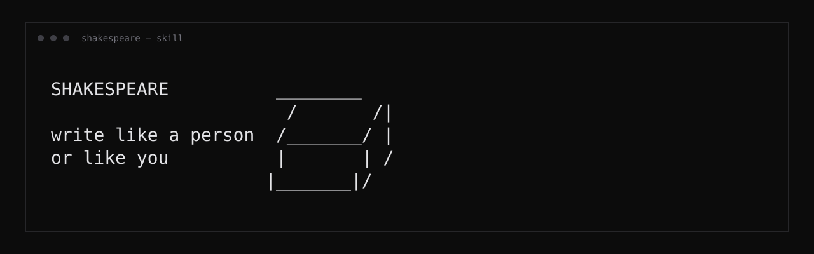

<p align="center">
  
</p>

<p align="center">
  <a href="#install"></a>
  <a href="LICENSE"></a>
  
  
</p>

<p align="center">
  <code>email</code> · <code>essay</code> · <code>post</code> · <code>story</code> · <code>academic</code> · <code>chat</code> · <code>voice-match</code>
</p>

---

# Shakespeare

Your agent already writes. It just writes like a product brochure with a soul patch.

**Shakespeare** is a drop-in skill that forces a real process: steal your ideas first, read human samples, draft in chunks, then check the work like it matters. Generic human, or *your* voice if you feed it your writing.

Not a magic "undetectable" button. If you give it nothing private, you get nothing private.

---

## Install

```bash
git clone https://github.com/sisiphamus/shakespeare.git
```

Point any agent at the folder:

```text
Use the Shakespeare skill in this folder.
Read AGENTS.md then SKILL.md. Follow the process.
```

| Host | Notes |
|------|--------|
| Claude Code | Path or symlink into skills |
| Codex / Cursor | Same one-liner |
| Hermes / OpenClaw | Drop on the skill path (`SKILL.md` + `AGENTS.md`) |

---

## What you get

```
you dump topic + takes + messy notes
        │
        ▼
┌───────────────────┐
│  samples by genre │  academic · narrative · chat · fun · email
└─────────┬─────────┘
          ▼
┌───────────────────┐
│  craft + banlist  │  rhythm, grit, hard kills
└─────────┬─────────┘
          ▼
┌───────────────────┐
│  section drafts   │  you keep interrupting with real details
└─────────┬─────────┘
          ▼
┌───────────────────┐
│  must check work  │  re-read rules, fix, then ship
└───────────────────┘
```

Two modes:

| Mode | When |
|------|------|
| **generic human** | samples + rules |
| **your voice** | same + your docs / Drive / sent mail |

No files, no MCP? Generic human. Don't invent a "you."

---

## Hard kills (the stuff that always reeks)

These get cut on review. Full list lives in `rules/`.

| Die | Examples |
|-----|----------|
| Interest labels | "that's where it gets interesting," "weirdly interesting" |
| Pointer glue | "the part people see," "the section that matters" |
| Definition snaps | "That joining is fusion." |
| Fake-plain gloss | "shows up as heat and light," "falls out as" |
| Short S–V–O hooks | "The mower started on the third pull." as every paragraph open |
| Sealed kits | stock vignette essays, multi-beat coach memos for a 3-line email |
| Costume casual | fragment stacks, "I'll be blunt," workshop metaphors nobody says |

**Grit over color.** Your awkward real detail beats a clever invented one every time.

---

## Layout

```text
shakespeare/
├── AGENTS.md      ← entry + MUST CHECK YOUR WORK
├── SKILL.md       ← full process
├── rules/
│   ├── craft.md
│   ├── ai-tells.md
│   ├── reader-psych.md
│   └── REVIEW.md
├── samples/       ← real human text (see SOURCES.md)
│   ├── academic/
│   ├── narrative/
│   ├── conversational/
│   ├── fun/
│   └── email/
└── assets/
    └── banner.svg
```

Samples: Project Gutenberg, PLOS (CC BY), Enron public release, NUS SMS excerpts. Licenses on the files.

---

## License

MIT for the skill packaging and rules. Sample text keeps whatever license is in its header.

---

<p align="center"><sub>built because banlists alone do not fix rhythm</sub></p>
